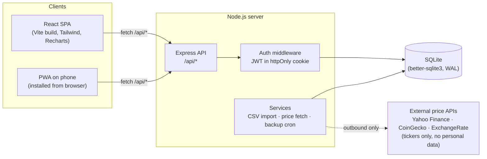
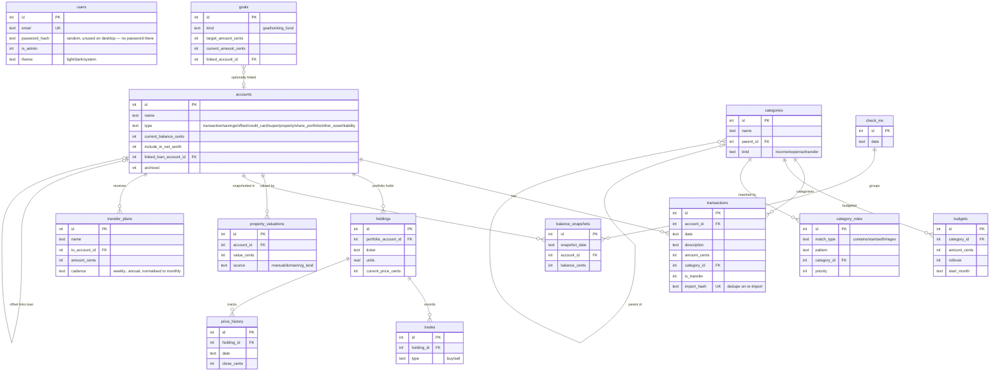
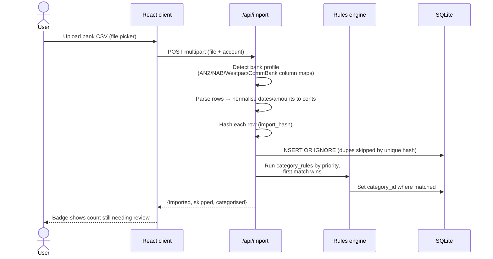
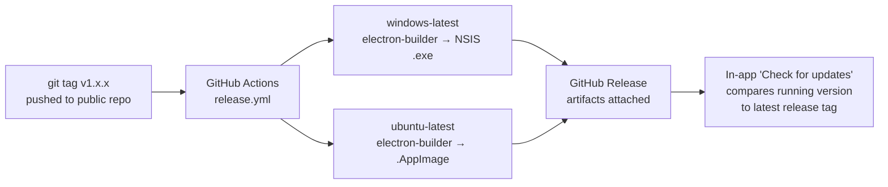

# Architecture

How Havoro is put together, for contributors and for anyone who wants to scrutinise the design before trusting it with their finances. Diagrams are [Mermaid](https://mermaid.js.org/) and render directly on GitHub.

If you spot a design problem, please open an issue — scrutiny is the point of publishing this.

---

## System overview

One Node.js/Express server owns a single SQLite file. Everything else is a client of that server. The same server code runs in every deployment mode — the only thing that changes is what starts it and where the database file lives.

Key properties:

- **No ORM** — hand-written SQL via `better-sqlite3` (synchronous, in-process, WAL mode). No connection pool, no network hop to the database.
- **No accounts server, no telemetry** — the only outbound traffic is share/crypto price lookups (ticker symbols only) and the user-initiated update check against the GitHub releases API.
- **Auth** is a JWT in an httpOnly cookie, verified by middleware on every `/api` route except `/api/health` and login.
- **Money is integer cents everywhere** — no floats in the database or the API.

## Deployment modes

```mermaid
flowchart TB
    subgraph desktop ["Desktop app (Windows / Linux)"]
        EM["Electron main process<br/>single-instance lock · tray icon"]
        ES["Server child process<br/>spawned with ELECTRON_RUN_AS_NODE=1"]
        EW["BrowserWindow<br/>loads http://localhost:PORT"]
        ED[("SQLite in user data dir<br/>+ backup once per day on launch")]
        EM -->|spawns| ES
        EM -->|creates| EW
        EW -->|HTTP| ES
        ES --> ED
    end

    subgraph selfhost ["Self-hosted (Pi / NAS / Docker)"]
        DC["Docker container<br/>node server/index.js<br/>serves built client from /client/dist"]
        DV[("SQLite in named volume<br/>havoro-data")]
        BR["Any browser / PWA<br/>on the home network"]
        BR -->|"http://pi:3000"| DC
        DC --> DV
    end

    subgraph dev ["Development"]
        VITE["Vite dev server :5173<br/>proxies /api → :3000"]
        NS["node --watch server :3000"]
        VITE -->|proxy| NS
    end
```

The Electron wrapper is deliberately thin: it spawns the same server as a child process (with `ELECTRON_RUN_AS_NODE=1` so the Electron binary behaves as plain Node.js), waits for `/api/health`, then opens a window pointed at localhost. All app logic lives in the server and SPA, so the desktop and self-hosted experiences can't drift apart.

The one exception is `electron/preload.js` — a small `contextBridge` boundary (`nodeIntegration: false`, `contextIsolation: true` throughout) that exposes exactly two things to the renderer: downloading an update installer with progress, and handing the downloaded file to the OS to run. Everything else the renderer needs comes from the same HTTP API as self-hosted mode.

## Database schema

Schema lives in [`server/db/schema.sql`](../server/db/schema.sql) (idempotent `CREATE TABLE IF NOT EXISTS`), with additive live migrations in [`server/db/db.js`](../server/db/db.js) so existing databases upgrade in place on every start. Categories, starter rules, and the admin user are seeded on first run.

## CSV import pipeline

The feature most likely to touch users' trust — bank data — never leaves the machine:

Re-importing an overlapping date range is safe — the `import_hash` unique constraint makes import idempotent.

## Release pipeline

Version source of truth: the `version` field in the four `package.json` files (root, `server/`, `client/`, `electron/`), kept in lockstep with the release tag. The Settings → About panel reads the server's copy at runtime.

## Security model (summary)

Full detail in [SECURITY.md](SECURITY.md). The short version:

- Passwords: bcrypt (cost 12). Sessions: JWT in httpOnly cookie, `JWT_SECRET` required or the server refuses to boot.
- Helmet security headers; JSON body limit; CORS locked to the dev origin outside production.
- The desktop app generates and stores its own random JWT secret on first run.
- SQLite file permissions are the user's own; Docker runs as a non-root user.
- No secrets in the repository — configuration via environment variables only.

## Planned: device sync

Sync between the desktop app and the upcoming iPhone app is designed (hub-and-spoke over LAN, row-timestamp change tracking, last-write-wins) but not yet built. The full design, including the schema groundwork shipping ahead of the phone app, is in [SYNC-DESIGN.md](SYNC-DESIGN.md).
