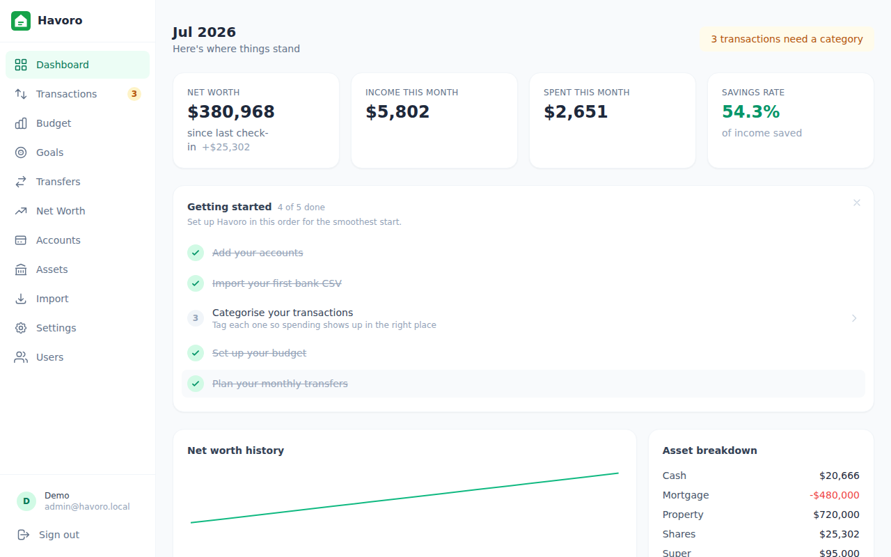
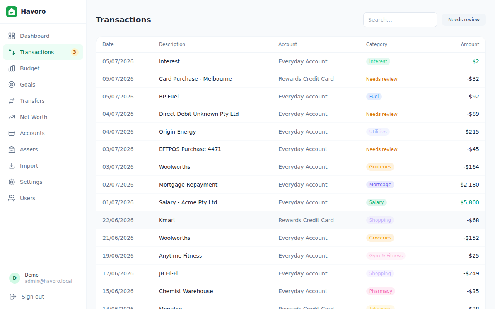
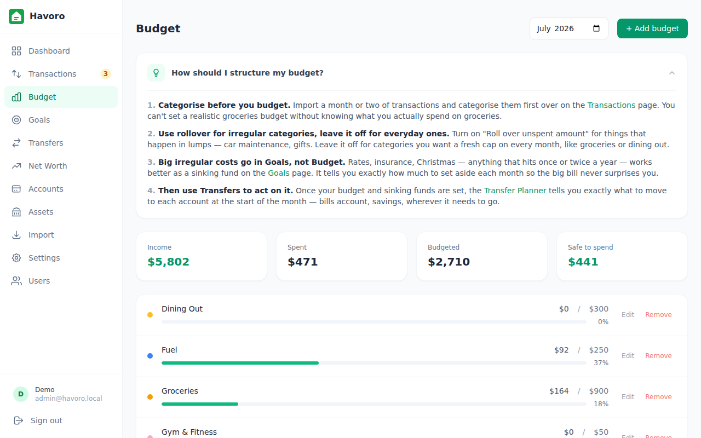
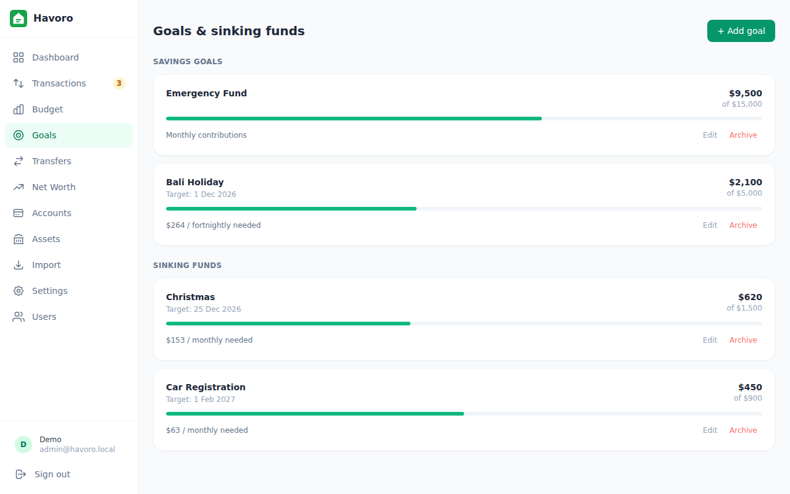
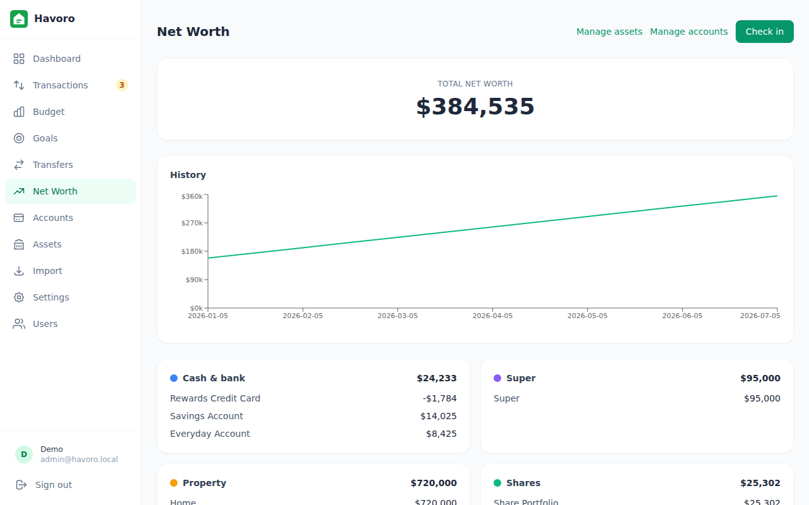
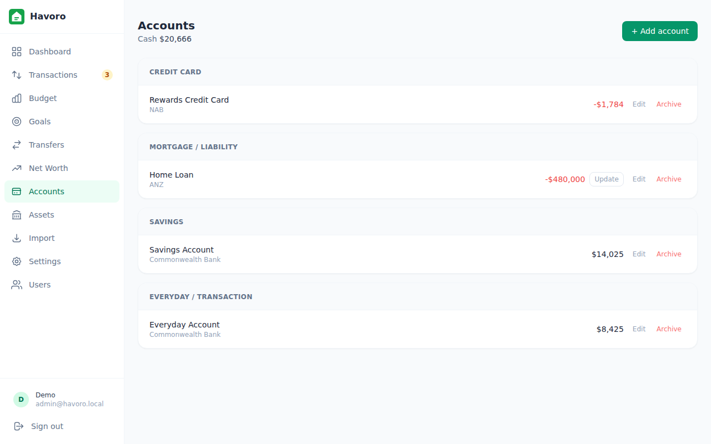
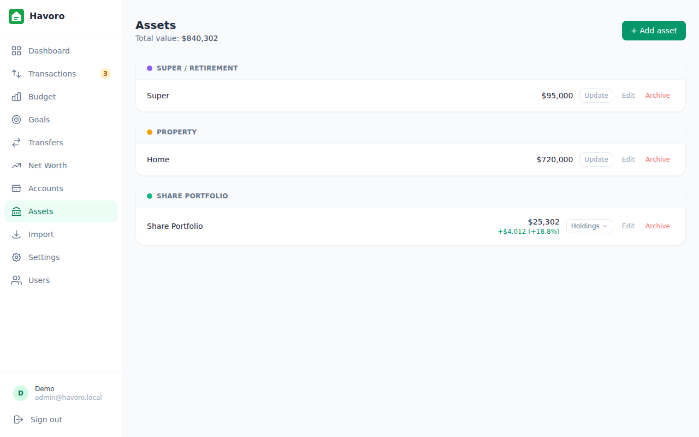
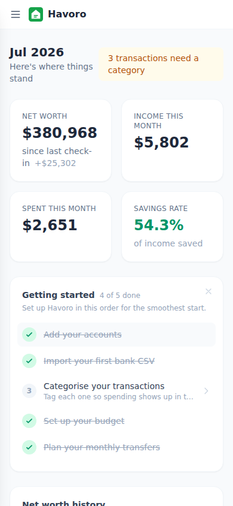
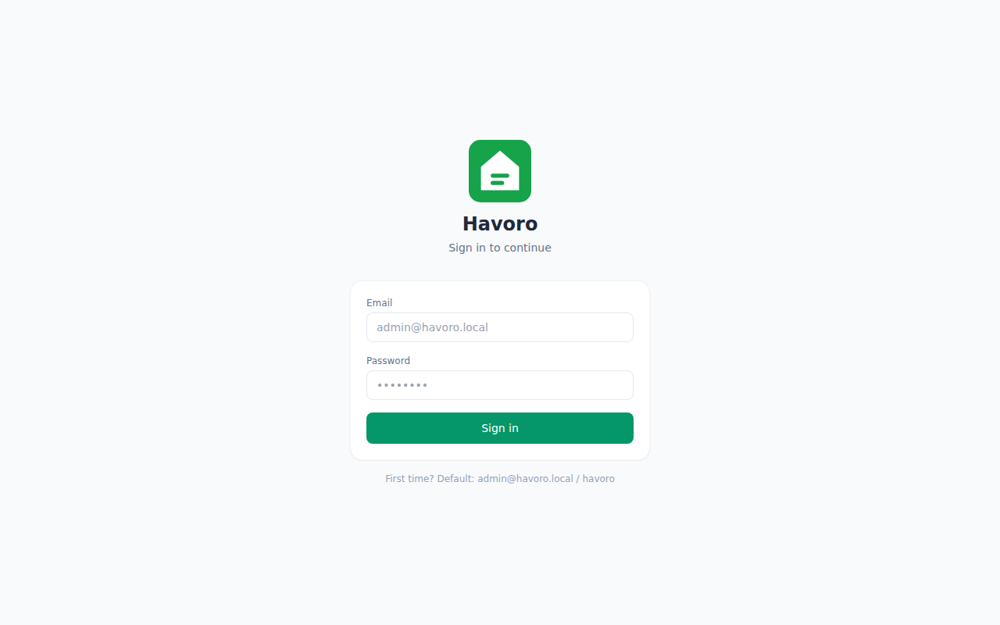

# Havoro — Feature Guide

Complete walkthrough of every feature in Havoro.

---

## Dashboard

The dashboard is your daily overview. It loads when you sign in and shows:

- **Net worth** — total of all accounts marked _include in net worth_, broken down by asset class (cash, super, property, shares, other assets, liabilities)
- **Monthly snapshot** — current month's income, expenses, and savings rate
- **Top expense categories** — the 6 biggest spending categories this month
- **Needs review** — count of transactions that haven't been categorised yet; tapping takes you to the filtered transaction list
- **Active goals** — up to 4 goals with progress bars
- **Net worth trend** — line chart of the last 6 check-ins

The month shown is always the current calendar month.

---

## Transactions

### Importing

Havoro only accepts bank-exported CSVs — it never connects directly to your bank.

1. Export a CSV from your bank's internet banking (usually under Transactions → Export/Download)
2. Go to **Import** in the sidebar
3. Select your bank profile (ANZ, NAB, Westpac, CommBank included)
4. Preview the parsed rows, then confirm

Transactions are deduplicated on import using a hash of date + description + amount, so re-importing the same file is safe.

**Adding a new bank profile:** See [TECHNICAL.md — Bank CSV profiles](TECHNICAL.md#bank-csv-profiles).

### Categorising

Transactions come in uncategorised. Havoro auto-categorises using **rules** (Settings → Categorisation rules):

- **Contains** — description contains a string (e.g. "WOOLWORTHS" → Groceries)
- **Starts with** — description starts with a string
- **Regex** — full regular expression match

Rules have a priority (lower = higher priority) and can be enabled/disabled individually. 20 starter rules are seeded on first run.

For one-off transactions, click the transaction, choose a category, and optionally click **Suggest rule** to auto-generate a rule based on that description.

### Filters

The transaction list can be filtered by:

- Account
- Category
- Date range
- Free-text search (matches description and notes)
- **Needs review** — shows only uncategorised, non-transfer transactions

### Transfers

Transactions that move money between your own accounts (e.g. salary into savings, credit card payment) can be marked as transfers. They're excluded from budget and category calculations.

---

## Budget

Set a monthly budget for any category. Havoro compares actuals from imported transactions against your budget and shows:

- Amount budgeted and spent per category
- Remaining (green) or over-budget (red) amount
- **Safe to spend** — income minus total budgeted spend
- Total income and expense for the month
- Uncategorised spend (as a reminder to review)

Budgets can optionally **roll over** — any unspent amount carries forward to the next month's budget.

Navigate between months using the arrows at the top of the page.

---

## Goals & Sinking Funds

### Goals (savings goal)

A one-off savings target with a name, target amount, optional target date, current amount, and contribution cadence. Havoro calculates how much you need to contribute per week/fortnight/month to hit the target by the date.

### Sinking funds

A recurring expense pot — money you set aside regularly for known future costs (car registration, holiday, annual insurance). Same structure as a goal but the focus is on regular contributions rather than a fixed end date.

Goals can optionally be linked to a specific account so the current balance auto-reflects.

---

## Net Worth

A breakdown of your net worth across five asset classes:

| Class | Account types included |
|---|---|
| Cash | Transaction, savings, offset |
| Super | Super |
| Property | Property |
| Shares | Share portfolio |
| Mortgage | Liability |

A trend chart shows the last 6 check-in snapshots. LVR (loan-to-value ratio) is shown for any property account linked to a mortgage, alongside the configured LVR ceiling.

---

## Accounts

Manage all your financial accounts in one place. Account types:

| Type | Purpose |
|---|---|
| Transaction | Everyday bank account |
| Savings | High-interest savings |
| Offset | Mortgage offset account |
| Credit card | Credit card / liability |
| Super | Superannuation |
| Property | Property asset |
| Share portfolio | Equities / ETF portfolio |
| Other asset | Anything else of value |
| Liability | Loan, HECS, other debt |

**Manual balance accounts** (super, property, other assets) can have their balance updated directly from the Accounts page. Transaction/savings accounts get their balance from imported transactions.

Accounts can be linked: a property account can reference a mortgage account for LVR calculation.

---

## Assets

Advanced asset tracking for accounts that need more than a single balance.

### Share portfolios

Track individual stock/ETF holdings inside a portfolio account. Expand any share portfolio row to see its holdings panel:

- **Ticker + exchange** — e.g. BHP on ASX, AAPL on NASDAQ
- **Yahoo Finance symbol** — auto-computed (e.g. `BHP.AX` for ASX, bare ticker for US), with manual override if needed
- **Units held** and **average cost per unit**
- **Current price** — fetched automatically via Stooq (primary) or Yahoo Finance (fallback), or entered manually via the edit form if auto-fetch is unavailable
- **Value and gain/loss** — computed live from price × units vs average cost
- **Portfolio gain/loss** — the portfolio row in the asset table shows total unrealised gain/loss (amount + %) vs average cost across all holdings
- **Refresh prices** — fetch the latest prices on demand from the holdings panel without opening a check-in; updates the portfolio account balance immediately

### Property valuations

Track how a property's value has changed over time. Add a valuation with:

- Date
- Value
- Source (manual, Domain, VG Land)
- Confidence level

The latest valuation is used as the account's current balance for net-worth calculations.

### Balance projections

Havoro can project future account balances based on assumed growth rates. Default rates are set in **Settings → Growth assumptions**:

- Cash: 4.5% p.a.
- Shares: 9% p.a.
- Property: 5% p.a.
- Super: 8% p.a.

---

## Check-ins

A check-in snapshots the current balance of every account marked _include in net worth_. This builds the history that powers the net-worth trend chart.

**How to do a check-in:**

1. Make sure your imported transactions are up to date
2. Go to **Net Worth** and click **Check in**
3. For share portfolios, live prices are fetched automatically (Stooq → Yahoo Finance fallback) — the portfolio value is pre-filled
4. Review and adjust any balances, add an optional note, then click **Complete check-in**

The modal groups accounts by type (cash & bank, super, property, shares, liabilities) and shows a live net worth preview as you edit. The system prevents two check-ins on the same calendar day.

### Live share prices

When the check-in modal opens, Havoro fetches current prices for all tracked holdings. Supported markets include:

- **ASX** — symbols converted to Stooq format (e.g. BHP → `bhp.au`)
- **LSE** — symbols converted to Stooq format (e.g. HSBA → `hsba.uk`)
- **NYSE / NASDAQ** — symbols converted to Stooq format (e.g. AAPL → `aapl.us`)

**Price provider chain:** Stooq is tried first (free, no API key, CSV-based). If Stooq fails, Yahoo Finance (`yahoo-finance2`) is tried as a fallback using the holding's Yahoo symbol field.

Prices are cached for 1 hour per holding. If all fetches fail (e.g. market closed, price provider issue), the last known price is used and a warning is displayed. You can also enter or override prices manually at any time via the Edit holding form.

You can also refresh prices directly from the Assets page without opening a check-in — click **Refresh prices** in the holdings panel for any share portfolio.

---

## Import

The import flow:

1. **Select bank profile** — determines how columns in the CSV map to date/description/amount
2. **Upload CSV** — exported directly from your bank's online banking
3. **Preview** — see the first 10 rows parsed before committing
4. **Select account** — which Havoro account to import into
5. **Import** — transactions are written; already-seen transactions (by hash) are silently skipped

After import, any transaction that matches a categorisation rule is automatically categorised. The rest land in the _Needs review_ queue.

---

## Settings

Most settings are admin-only. A few sections only apply to one deployment mode — noted below.

### Appearance

Light, dark, or system theme. Saved to your account, so it follows you to any device you sign in on.

### Database backups

- **Manual backup** — creates an immediate backup, any time, one click
- **Import a backup file** — restore from any `.db` file you pick from disk, not just this machine's own stored backups (e.g. one copied over from another computer). The file is checked before anything is touched, and the current database is backed up first as a safety net.
- **Backup list** — see all stored backups with size and date
- **Restore** — restores from any listed backup; the app restarts automatically
- **Scheduled backup** *(self-hosted only)* — configure the cron schedule (default: 2 AM daily). The desktop app backs up once per day on launch instead — a fixed clock time only means something on an always-on server, so there's no schedule to configure there.

Backups are SQLite `.db` files stored in the `backups/` folder (self-hosted) or `%APPDATA%\Havoro\backups` (desktop).

### Check for updates

Compares your version against the latest GitHub release. On desktop, an available update can be downloaded and installed without leaving the app — **Download & install** shows live progress, then **Restart & install** finishes it. Your data is untouched either way.

### Growth assumptions

Default annual growth rates used for future balance projections (cash, shares, property, super).

### Categorisation rules

Create, edit, enable/disable, and delete auto-categorisation rules. Rules are applied in priority order (lower number = higher priority) and the first match wins.

### Categories

Manage the category hierarchy. Categories can have a parent (e.g. "Groceries" under "Food"), a kind (income/expense/transfer), a colour, and an icon.

---

## Mobile

Havoro is fully responsive and installable as a PWA (Progressive Web App). On iOS and Android, use **Add to Home Screen** from your browser to install it as a native-feeling app with its own icon and full-screen experience. No app store required.

**Automatic updates:** When a new version is deployed, the PWA detects the update the next time you open the app and reloads automatically — no force-close or manual refresh needed.

---

## Login

**Desktop:** no login at all. First launch just asks for your first name, used for greetings like "Afternoon, Alex" on the dashboard — nothing else. Every later launch signs you back in automatically; there's no password to forget.

**Self-hosted:** real accounts, since more than one person on the network could reach it. The first person to open it creates the admin account with a name, email, and password — there's no default account.

---

## Users

Self-hosted only — desktop has no multi-user concept, so there's no Users section there at all. Admin-only.

- **Admin** — full access including Settings, Backups, User management
- **Member** — full access to all financial data; cannot manage users or change system settings

Users cannot delete themselves or remove the last admin account.

---

## Profile

Every user can update their display name. Self-hosted users can also change their password (requires current password, minimum 8 characters) — not shown on desktop, since there's no password there to change.

---

## Roadmap (planned, not yet built)

- **iPhone app** — a native app with the same no-cloud model: your data in a local database on the phone, nothing hosted anywhere. The PWA (self-hosted route) covers phone access in the meantime.
- **Device sync** — desktop ↔ phone sync over your local Wi-Fi, with no third-party servers involved. Designed up front so the phone app is built around it — full design in [SYNC-DESIGN.md](SYNC-DESIGN.md). Schema groundwork ships ahead of the phone app so existing databases will be sync-ready.
