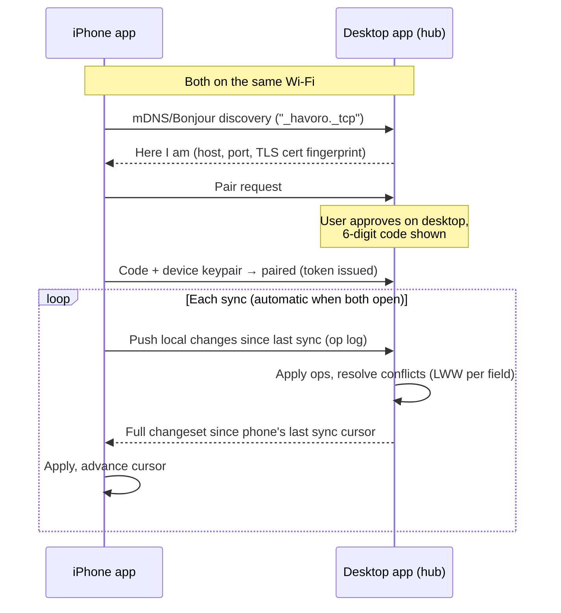

# Device Sync — design document

**Status: planned, not yet built.** This documents how sync between the desktop app and the upcoming iPhone app will work, written down *before* the iPhone app is built so the phone app is designed around it from day one rather than retrofitted.

---

## The problem

Havoro's core promise is that your data lives on your hardware — a single SQLite file per install. The moment someone runs the desktop app *and* a phone app, there are two SQLite files that drift apart. Sync has to reconcile them **without introducing a cloud server**, because "we sync through our servers" would break the product's one non-negotiable rule.

Self-hosted (Pi/Docker) users don't have this problem: the server is the single source of truth and every client (browser, PWA, future iPhone app in companion mode) reads and writes through the same API. Sync only matters for the **desktop app + standalone phone app** pairing.

## Constraints

1. **No third-party server.** Sync happens device-to-device on the local network, or through storage the user already owns (their iCloud), never through infrastructure we run.
2. **SQLite on both ends.** Same schema on desktop and phone.
3. **Offline-first.** Either device must work fully offline for weeks and reconcile later.
4. **The user shouldn't need to understand it.** Open both apps on the same Wi-Fi → they find each other → they sync.

## Chosen architecture: hub-and-spoke over LAN

The **desktop app is the hub** (source of truth); the phone is a spoke. This is dramatically simpler than peer-to-peer merge and matches how people actually use the product: the desktop is where CSVs get imported and the heavy lifting happens; the phone is for checking, categorising on the couch, and adding the odd manual transaction.



### How changes are tracked

Every table that syncs gets two extra columns (added by migration, ignored by the current app):

| Column | Purpose |
|---|---|
| `updated_at` | Millisecond timestamp of last write, set on every INSERT/UPDATE |
| `deleted_at` | Tombstone — rows are soft-deleted so deletions propagate |

Plus one new table:

```sql
CREATE TABLE sync_state (
  device_id   TEXT PRIMARY KEY,   -- paired device
  last_cursor INTEGER NOT NULL,   -- max updated_at already sent to that device
  paired_at   TEXT NOT NULL,
  device_name TEXT
);
```

This is **row-timestamp sync**, not a full CRDT. It's much simpler and it's enough, because Havoro rows are almost never edited concurrently on two devices — the realistic conflict is "phone categorised a transaction while desktop also categorised it", and for that:

### Conflict policy: last-write-wins, per row

- The row with the newer `updated_at` wins; the loser is discarded.
- Deletion (tombstone) beats edit if the delete is newer.
- `import_hash` already guarantees the same bank transaction imported on both devices dedupes to one row.
- Non-syncing tables: `users` (auth is per-device on standalone installs), `settings`, `sync_state` itself.

**Why not CRDTs / op-logs with merge?** Cost/benefit. A field-level merge engine is weeks of work and a large ongoing test surface, to handle a conflict that in practice occurs when one person edits the same transaction on two devices within one sync window. LWW loses one edit in that rare case; the UI will show a toast ("3 changes came from your desktop") so nothing happens silently.

### Transport & security

- Discovery: mDNS/Bonjour on the LAN (same mechanism AirPrint uses). No internet required.
- Pairing: one-time 6-digit code displayed on the desktop, entered on the phone; devices exchange keys; subsequent syncs authenticate with the stored token.
- Transport: HTTPS with a self-signed cert pinned at pairing time (the fingerprint exchanged during pairing prevents MITM on hostile networks).
- The sync endpoint lives in the existing Express server under `/api/sync/*` and is **disabled unless the user turns sync on** in Settings.

### Fallback for non-technical users: file-based sync

If LAN discovery fails (client isolation on the router, etc.), Plan B is manual: Settings → "Export sync bundle" produces a single encrypted file the user AirDrops or saves to their own iCloud Drive; the other device imports it. Same change-log format, human-triggered transport. Clunky but zero-infrastructure and works everywhere.

## Phasing

| Phase | Scope | When |
|---|---|---|
| 0 (now) | Schema groundwork: add `updated_at`/`deleted_at` columns and set them on writes, so historical data is sync-ready before the phone app exists | Next release |
| 1 | Read-only phone: phone pulls full snapshot from desktop over LAN, no push. Covers "check my budget on the couch" | With iPhone app v1 |
| 2 | Two-way sync: op push from phone, LWW conflict resolution, sync status UI | iPhone app v1.x |
| 3 | File-based sync bundle fallback | As demanded |

Phase 0 is deliberately cheap and shippable now — it means every database created from the next release onward can sync without migration pain later.

## What this means for the self-hosted mode

Nothing changes. Pi/Docker users already have real-time "sync" because every device talks to one server. The iPhone app will offer **companion mode** (point it at your server URL, same API as the PWA) as an alternative to standalone-with-sync — whichever fits the user's setup.
